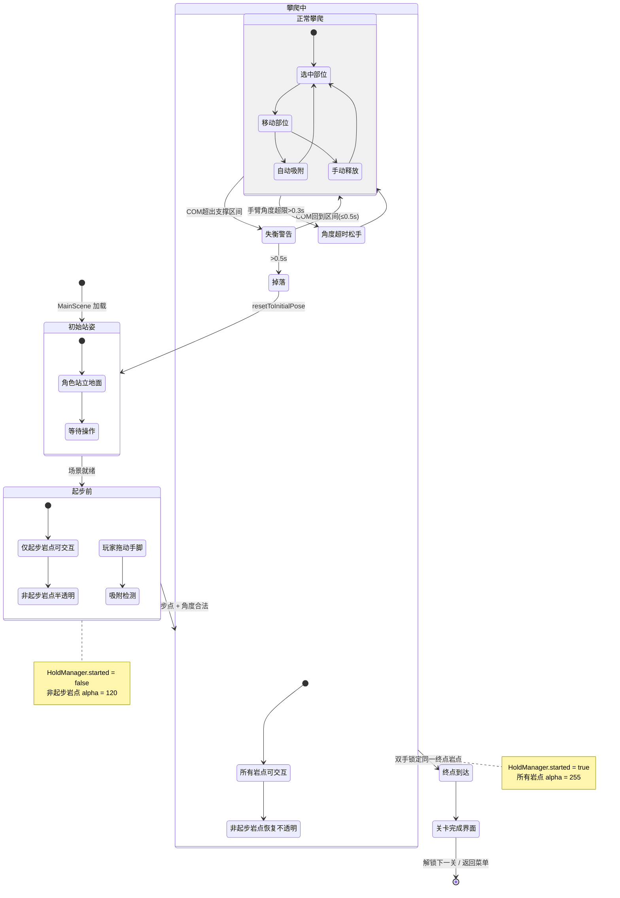
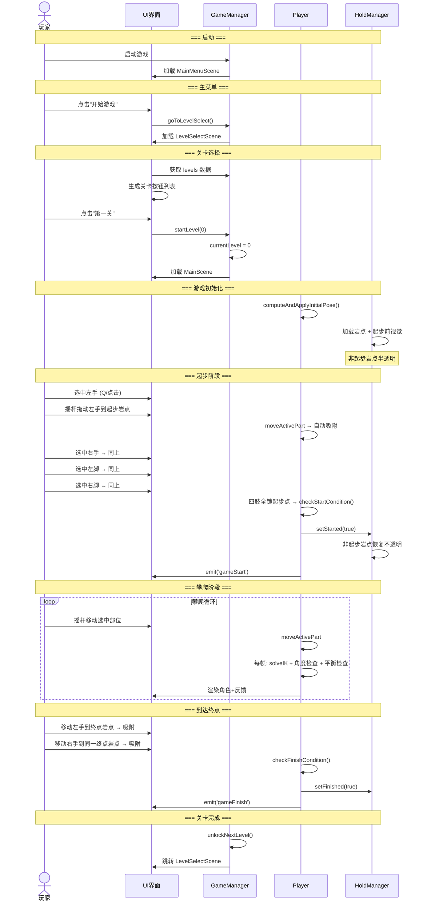

# 攀岩游戏 — 流程图 · UI界面 · 关卡系统

> 本文档描述游戏从启动到结束的完整流程、所有 UI 界面及关卡系统。
> 面向：策划、UI 设计师、QA 测试。

---

## 一、场景架构

### 1.1 场景列表

| 场景 | 用途 | 关键组件 |
|------|------|----------|
| `InitScene` | 启动场景，初始化 GameManager 单例 | `GameManager` |
| `MainMenuScene` | 主菜单 | `MainMenuUI` |
| `LevelSelectScene` | 关卡选择 | `LevelSelectUI` |
| `MainScene` | 游戏主场景（攀岩） | `Player`, `UIController`, `Joystick`, `GameHUD`, `HoldManager` |

### 1.2 场景切换流程

```mermaid
flowchart TD
    A[游戏启动] --> B[InitScene]
    B -->|自动跳转| C[MainMenuScene<br/>主菜单]
    C -->|点击"开始游戏"| D[LevelSelectScene<br/>关卡选择]
    D -->|点击关卡| E[MainScene<br/>游戏主场景]
    E -->|暂停 → 返回主菜单| C
    E -->|完成关卡| F{有下一关?}
    F -->|是| D
    F -->|否| C
    E -->|暂停 → 重新开始| E
```

---

## 二、完整游戏流程图

```mermaid
flowchart TD
    subgraph 启动
        A1((游戏启动)) --> A2[InitScene 加载]
        A2 --> A3[GameManager 初始化<br/>设为常驻节点]
        A3 --> A4[跳转 MainMenuScene]
    end

    subgraph 主菜单
        B1[主菜单界面]
        B1 --> B2{玩家操作}
        B2 -->|开始游戏| B3[跳转 LevelSelectScene]
        B2 -->|设置| B4[打开设置面板]
        B4 --> B5{设置项}
        B5 -->|音效开关| B4
        B5 -->|关闭设置| B1
    end

    subgraph 关卡选择
        C1[关卡选择界面]
        C1 --> C2[加载关卡列表]
        C2 --> C3[显示关卡按钮]
        C3 --> C4{玩家操作}
        C4 -->|点击已解锁关卡| C5[设置 currentLevel]
        C5 --> C6[跳转 MainScene]
        C4 -->|点击未解锁关卡| C7[无反应]
        C4 -->|返回| B1
    end

    subgraph 游戏主循环
        D1[MainScene 加载]
        D1 --> D2[Player.start]
        D2 --> D3[computeAndApplyInitialPose<br/>角色初始站姿]
        D3 --> D4[HoldManager.onLoad<br/>加载岩点 + 起步前视觉]
        D4 --> D5[GameHUD.onLoad<br/>显示关卡名]
        D5 --> D6["🎮 游戏进行中"]

        D6 --> D7{每帧 update}
        D7 --> D8[Player.update]
        D8 --> D9[solveAllChains<br/>求解四肢IK]
        D9 --> D10[clampFeetAboveGround<br/>脚不穿透地面]
        D10 --> D11[checkArmForceAngles<br/>手臂角度检查]
        D11 --> D12[checkBalance<br/>平衡检查]
        D12 --> D13[drawCharacter<br/>渲染角色+反馈]
        D13 --> D14[UIController.update<br/>摇杆输入处理]
        D14 --> D7

        D6 --> D15{事件触发}
        D15 -->|起步条件满足| D16["emit('gameStart')<br/>HoldManager.setStarted(true)<br/>非起步岩点恢复不透明"]
        D15 -->|终点条件满足| D17["emit('gameFinish')<br/>HoldManager.setFinished(true)"]
        D15 -->|失衡掉落| D18[onFall → resetToInitialPose]
        D15 -->|按R键| D18
        D15 -->|暂停按钮| D19[暂停面板]
    end

    subgraph 暂停菜单
        D19 --> D20{director.pause()}
        D20 --> D21{玩家操作}
        D21 -->|继续| D22[director.resume() → D6]
        D21 -->|重新开始| D23[director.resume() → restartLevel → D1]
        D21 -->|返回主菜单| D24[director.resume() → goToMainMenu → B1]
    end

    subgraph 关卡完成
        D17 --> E1[显示完成提示]
        E1 --> E2{有下一关?}
        E2 -->|是| E3[unlockNextLevel]
        E3 --> E4[跳转 LevelSelectScene]
        E2 -->|否| E5[跳转 MainMenuScene]
    end

    D16 --> D6
    D18 --> D6
```

---

## 三、UI 界面详细设计

### 3.1 主菜单界面（MainMenuScene）

```
┌──────────────────────────────────────────┐
│                                          │
│           [背景图]                        │
│                                          │
│              RockPro                     │
│           (游戏标题)                      │
│                                          │
│        ┌──────────────┐                  │
│        │   开始游戏    │                  │
│        └──────────────┘                  │
│        ┌──────────────┐                  │
│        │    设  置    │                  │
│        └──────────────┘                  │
│                                          │
└──────────────────────────────────────────┘
```

| 元素 | 说明 |
|------|------|
| 背景图 | `backgroundNode`，游戏主题背景 |
| 标题 | `"RockPro"`，游戏名称 |
| 开始游戏 | 跳转到关卡选择界面 |
| 设置 | 打开设置面板（弹出层） |

**设置面板**（默认隐藏）：

```
┌──────────────────────────┐
│        设  置            │
│                          │
│  音效： [开] ←→ [关]     │
│                          │
│        ┌──────┐          │
│        │ 关闭 │          │
│        └──────┘          │
└──────────────────────────┘
```

| 元素 | 说明 |
|------|------|
| 音效开关 | 切换 `soundEnabled`，更新标签文字 |
| 关闭 | 隐藏设置面板，回到主菜单 |

---

### 3.2 关卡选择界面（LevelSelectScene）

```
┌──────────────────────────────────────────┐
│  ← 返回      选择关卡                    │
│                                          │
│  ┌────────────────────────────────────┐  │
│  │  ┌──────────────────────────┐      │  │
│  │  │  第一关：初识攀岩         │  ✅  │  │
│  │  └──────────────────────────┘      │  │
│  │  ┌──────────────────────────┐      │  │
│  │  │  第二关：XXXXXX          │  🔒  │  │
│  │  └──────────────────────────┘      │  │
│  │  ┌──────────────────────────┐      │  │
│  │  │  第三关：XXXXXX          │  🔒  │  │
│  │  └──────────────────────────┘      │  │
│  │        ...（可滚动）                │  │
│  └────────────────────────────────────┘  │
│                                          │
└──────────────────────────────────────────┘
```

| 元素 | 说明 |
|------|------|
| 返回按钮 | 回到主菜单 |
| 标题 | `"选择关卡"` |
| 关卡列表 | 滚动列表，由 `levelButtonPrefab` 动态生成 |
| 已解锁 | 正常显示，可点击进入 |
| 未解锁 | 灰色/锁定图标，不可点击 |

**关卡按钮内容**：
- 关卡名称（如 `"第一关：初识攀岩"`）
- 解锁状态图标（✅ / 🔒）

---

### 3.3 游戏主界面（MainScene）

```
┌──────────────────────────────────────────┐
│  ⏸ 暂停   第一关：初识攀岩               │  ← GameHUD 顶栏
│                                          │
│                                          │
│          ┌─────────────┐                 │
│          │   岩点区域   │                 │
│          │  🟡  🟡    │                 │
│          │     🟡     │                 │
│          │  🟡    🟡  │                 │
│          │            │                 │
│          │    👤 角色  │                 │  ← 游戏画面
│          │   /│\      │                 │
│          │   / \      │                 │
│          │            │                 │
│          │────────────│ ← 地面线        │
│          └─────────────┘                 │
│                                          │
├──────────────────────────────────────────┤
│  [左手]        [躯干]        [右手]      │  ← 部位按钮
│   (Q)           (S)           (E)        │
│  [左脚]        [摇杆]        [右脚]      │
│   (A)           (○)           (D)        │  ← 摇杆
└──────────────────────────────────────────┘
```

#### 3.3.1 GameHUD（顶部信息栏）

| 元素 | 说明 |
|------|------|
| 暂停按钮 ⏸ | 打开暂停面板 |
| 关卡名称 | 显示当前关卡名，如 `"第一关：初识攀岩"` |

#### 3.3.2 暂停面板（弹出层）

```
┌──────────────────────────┐
│        暂  停            │
│                          │
│    ┌──────────────┐      │
│    │   继续游戏    │      │
│    └──────────────┘      │
│    ┌──────────────┐      │
│    │   重新开始    │      │
│    └──────────────┘      │
│    ┌──────────────┐      │
│    │  返回主菜单   │      │
│    └──────────────┘      │
└──────────────────────────┘
```

| 按钮 | 行为 |
|------|------|
| 继续游戏 | `director.resume()`，关闭面板 |
| 重新开始 | `director.resume()` → `restartLevel()` |
| 返回主菜单 | `director.resume()` → `goToMainMenu()` |

#### 3.3.3 游戏画面（视觉反馈层）

详见 [UX 交互文档](./ux-interaction-document.md) 第三章。

---

## 四、游戏内状态机



---

## 五、关卡系统

### 5.1 关卡数据结构

```typescript
interface LevelInfo {
    id: number;          // 关卡 ID
    name: string;        // 关卡名称，如 "第一关"
    description: string; // 关卡描述，如 "初识攀岩"
    sceneName: string;   // 对应场景名
    unlocked: boolean;   // 是否已解锁
}
```

### 5.2 当前关卡配置

| ID | 名称 | 描述 | 场景 | 初始状态 |
|----|------|------|------|----------|
| 0 | 第一关 | 初识攀岩 | `MainScene` | ✅ 已解锁 |

### 5.3 关卡解锁流程

```mermaid
flowchart LR
    A[完成关卡 N] --> B{有 N+1 关?}
    B -->|是| C[levels[N+1].unlocked = true]
    C --> D[跳转关卡选择]
    B -->|否| E[跳转主菜单]
```

### 5.4 关卡设计要素

每个关卡的 `MainScene` 中需要配置：
- **岩点布局**：位置、类型、属性（吸附半径、释放半径、受力角度等）
- **起步点**：至少 4 个起步岩点（对应四肢），`isStartPoint = true`
- **终点**：至少 1 个终点岩点，`isFinishPoint = true`
- **出生点**：`spawnPoint` 节点控制角色初始 X 位置
- **地面**：`gameLayer` 的 UITransform 高度决定地面 Y 坐标

### 5.5 添加新关卡的步骤

1. 在 `GameManager.levels` 数组中添加新条目
2. 创建新场景（或复用 `MainScene` 调整岩点）
3. 设置新关卡的 `sceneName`
4. 前一关完成时自动解锁

---

## 六、事件系统

### 6.1 游戏事件

| 事件名 | 触发时机 | 发送者 | 监听者（预期） |
|--------|----------|--------|---------------|
| `gameStart` | 四肢全部锁定起步点 | `Player.node` | GameHUD / 特效系统 |
| `gameFinish` | 双手锁定同一终点 | `Player.node` | GameHUD / 结算界面 |

### 6.2 事件触发条件

**gameStart**：
1. `HoldManager.started === false`（未起步）
2. 四肢（左右手脚）全部在 `adsorbedHold` 中
3. 每个岩点都是 `isStartPoint`
4. 手臂在受力角度内（`isPartUnderForce`）
5. 脚部岩点支持站立或钩挂

**gameFinish**：
1. `HoldManager.started === true`（已起步）
2. `HoldManager.finished === false`（未结束）
3. 左手和右手锁定在**同一个**岩点
4. 该岩点 `isFinishPoint === true`
5. 双手均在受力角度内

---

## 七、完整操作序列（时序图）



---

## 八、界面跳转汇总表

| 从 | 到 | 触发方式 | 方法 |
|----|----|----------|------|
| InitScene | MainMenuScene | 自动 | `director.loadScene(mainMenuScene)` |
| MainMenuScene | LevelSelectScene | 点击"开始游戏" | `goToLevelSelect()` |
| MainMenuScene | 设置面板 | 点击"设置" | `settingsPanel.active = true` |
| LevelSelectScene | MainMenuScene | 点击"返回" | `goToMainMenu()` |
| LevelSelectScene | MainScene | 点击已解锁关卡 | `startLevel(index)` |
| MainScene | 暂停面板 | 点击 ⏸ | `director.pause()` |
| 暂停面板 | MainScene | 点击"继续游戏" | `director.resume()` |
| 暂停面板 | MainScene(重开) | 点击"重新开始" | `restartLevel()` |
| 暂停面板 | MainMenuScene | 点击"返回主菜单" | `goToMainMenu()` |
| MainScene | MainScene(重开) | 按R / 掉落 | `resetToInitialPose()` |
| MainScene | LevelSelectScene | 完成关卡 | `unlockNextLevel()` + 跳转 |
| MainScene | MainMenuScene | 完成最后一关 | `goToMainMenu()` |

---

## 九、关键常量

| 常量 | 值 | 说明 |
|------|-----|------|
| 双击判定间隔 | 0.3s | 单击/双击区分阈值 |
| 摇杆移动速度 | 200 px/s | 摇杆边缘持续推动时的速度 |
| 起步前非起步岩点透明度 | 120/255 | 视觉区分 |
| GameManager 跨场景 | `addPersistRootNode` | 常驻节点，场景切换不销毁 |