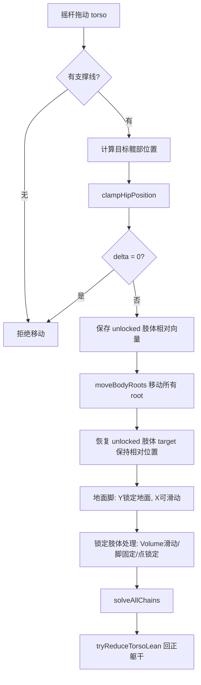
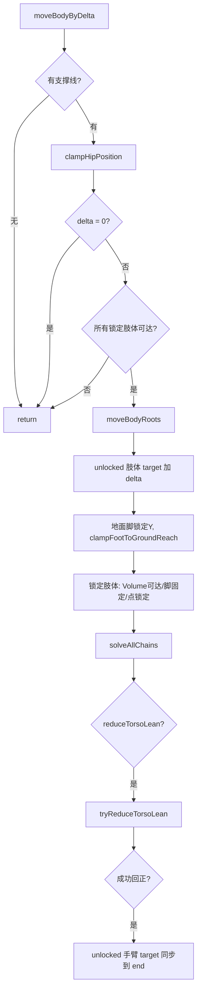

# Player 移动相关需求整理

## 一、输入层（UIController / Joystick）

### 1. 输入来源
| 输入方式 | 操作 | 对应方法 |
|---------|------|---------|
| 摇杆拖动 | 移动当前选中肢体/身体 | `Player.moveActivePart(dx, dy)` |
| 摇杆边界+方向 | 持续推动时额外加速度 | `moveSpeed * dt` × 方向 |
| 键盘 Q/E/A/D/S | 选中肢体（单击）/ 释放吸附（双击） | `selectPart()` / `releaseHoldAndCooldown()` |
| 键盘 W | 逐步回正躯干侧倾 | `Player.resetTorsoLeanIfPossible()` |
| 键盘 R | 完全重置角色 | `Player.resetToInitialPose()` |
| 身体按钮双击 | 切换 `followBodyWithArm`（身体随动手臂模式） | `Player.toggleBodyFollow()` |

### 2. 选中部件
```
BodyPart = 'leftHand' | 'rightHand' | 'leftFoot' | 'rightFoot' | 'torso'
```
- 默认选中 `torso`
- 选择时自动 `resetAllHoldCooldowns()`

---

## 二、核心移动入口

### `moveActivePart(dx, dy)` → 所有肢体/身体移动的分发器

根据 `this.activePart` 进入不同的 case：

---

## 三、四肢移动（leftHand / rightHand / leftFoot / rightFoot）

### 已吸附（adsorbedHold.has(part)）

#### Volume 吸附（滑块/长条岩点）
- **手部**：沿 Volume 线段滑动，自动裁剪到可达范围
  - 超出可达时先尝试 `tryAdjustTorsoForReach()`（躯干侧倾辅助）
- **脚部**：同手部，但有额外约束：
  - 必须在腿长可达范围内（`getReachablePointOnVolumeLine`）
  - 髋部不能低于脚+脚髋偏移（`footHipOffset`）
  - 髋部到双脚连线有符号距离 ≥ `minHipToFeetLineDist`

#### 点吸附
- **吸附保持期**（`Date.now() - lastAdsorbTime < dragHoldDelay * 1000`）：
  - 锁定在岩点位置，不接受拖动
- **脱离拖拽期**：
  - 累积 `dragOffset`，超出 `hold.releaseRadius` 后脱离吸附
  - 脱离时触发 `releaseHoldAndCooldown()`

### 未吸附 → 正常移动

1. **可达约束**：`constrainTargetToReach()` — 目标不能超过 `upperLen + lowerLen`
2. **手臂超出可达时**：
   - 先尝试 `tryAdjustTorsoForReach()`（躯干侧倾）
   - 如果 `followBodyWithArm` 为 true，剩余距离通过 `moveBodyByDelta()` 移动身体
3. **脚部限制**：
   - 髋部到双脚连线有符号距离 ≥ `minHipToFeetLineDist`
   - `footY + footHipOffset < hipY`
4. **自动吸附**：调用 `holdManager.findNearestHold()`，在范围内自动吸附
   - 优先检查 `timeoutReleasedHold`（超时脱落的岩点可无视冷却重新吸附）
   - 吸附后：更新 `lastAdsorbTime`、清除 `forceAngleTimer`、设置 `preferVertical/maxVerticalAngle`
   - 检查起步/结束条件

---

## 四、躯干移动（torso）



**需求：没有支撑线则无法移动身体** — `getSupportXRange()` 返回 null 时直接拒绝。

**需求1：没有任何锁定点时，站立脚Y锁地面、X可滑动。** — 通过保存/恢复相对向量实现，脚在地面上时 Y 固定为 `groundY`。

---

## 五、身体跟随移动（moveBodyByDelta）

由手臂超出可达时自动触发（`followBodyWithArm = true`），或由其他逻辑调用。



**关键检查**：`canAllLockedLimbsReachAfterBodyMove()` — 身体移动后所有锁定肢体必须仍能到达岩点。

---

## 六、髋部约束链（clampHipPosition）

所有身体移动都必须经过此约束链，按顺序应用：

### ① clampHipToAdsorbedLegs
- 遍历所有已吸附的脚，确保髋部连接点（hip ± hipHalfW）到脚目标的距离 ≤ 腿长
- 迭代 2 次处理多脚约束的耦合

### ② clampHipToAdsorbedArms
- 遍历所有已吸附的手，确保肩膀位置（hip + torsoLean ± shoulderHalfW）到手臂目标的距离 ≤ 臂长
- **Volume 分支**：检查肩膀到 Volume 线段两端点的最小距离
- **点吸附分支**：使用 `shoulderPos`（含 `torsoLean`）计算距离，约束后反算 hipX/hipY

### ③ clampHipToGroundFeet（仅无锁定点时）
- 确保站在地面上的脚（`isFootOnGround`）在腿长可达范围内
- 迭代 2 次处理双脚耦合

### ④ 髋部连线距离限制
- 髋部到双脚连线的有符号距离 ≥ `minHipToFeetLineDist`
- 双脚重合时（lenSq < 0.001）：髋部 Y ≥ footY + minHipToFeetLineDist
- 正常情况：用法向量投影计算并修正

### ⑤ 脚高度约束
- `hipY ≥ max(leftFootY, rightFootY) + footHipOffset`

---

## 七、支撑系统

### `getSupportXRange()` → `{min, max} | null`
支撑来源（按优先级）：
1. **已吸附的脚**（`allowFootStand = true`）：脚位置 ± `footWidth/2`
2. **地面上的脚**（`|footY - groundY| < groundStandTolerance`）：同上
3. **锁定且受力的手**：手位置 ± `footWidth * 0.8`

### `isComOverSupport()` → boolean
质心 X 坐标是否在支撑区间 `[min, max]` 内。无支撑区间时直接返回 false。

---

## 八、平衡与掉落

### 每帧检查（Player.update）
```
solveAllChains → clampFeetAboveGround → checkArmForceAngles → checkBalance
```

### 手臂角度检查（checkArmForceAngles）
- 小臂方向（mid → end）是否在 `hold.isForceInRange()` 允许范围内
- 超出时累计时间，超过 `forceAngleToleranceTime`(0.3s) 则 `releaseHoldAndCooldown(part, true)`

### 平衡检查（checkBalance）
- COM 不在支撑区间时累计 `imbalanceTimer`
- 超过 `balanceToleranceTime`(0.5s) → `onFall()`

### 掉落（onFall）
- 调用 `resetToInitialPose()` 完全重置

---

## 九、躯干侧倾系统（Torso Lean）

### 产生侧倾
- **tryAdjustTorsoForReach()**：手臂/腿超出可达范围时，通过躯干侧倾来辅助到达
  - 手臂：`leanDelta = dx/dist * dist * torsoAssistFactor * 0.3`
  - 腿部：`shiftX = dx/dist * min(dist * torsoAssistFactor * 0.25, maxTorsoLean * 0.5)`
  - 范围限制：`[-maxTorsoLean, maxTorsoLean]`（默认 40px）
  - 必须通过另一只锁定肢体的可达检查（`canOtherLockedArmReachAfterLean` / `canOtherLockedLegReachAfterLean`）

### 回正侧倾
- **tryReduceTorsoLean()**：每次身体移动后自动尝试以 1px 步长回正
  - 条件：双臂均能到达各自锁定目标
  - 返回值：是否成功减小了 torsoLean
- **resetTorsoLeanIfPossible()**：W 键触发的手动回正
  - 与 tryReduceTorsoLean 逻辑相同，但由用户主动触发

### 侧倾对肢体 root 的影响
- `torsoLean` 改变后必须调用 `updateShoulderPositions()`
- 手臂 root（shoulder）随 torsoLean 水平偏移
- 腿部 root（hip）不受 torsoLean 影响

---

## 十、地面系统

### 地面定义
- `groundY`：由 GameLayer 高度计算，底部留 50*scaleFactor 边距
- `groundStandTolerance`（10px）：脚 Y 在此范围内视为"站在地面上"

### 地面约束
| 时机 | 方法 | 作用 |
|------|------|------|
| 每帧 | `clampFeetAboveGround()` | 未吸附的脚不能低于地面 |
| 身体移动 | `clampFootToGroundReach()` | 脚Y锁地面时，确保X在可达范围内 |
| 身体移动 | `clampHipToGroundFeet()` | 无锁定时髋部不能离地面脚太远 |

---

## 十一、关键参数汇总

| 参数 | 默认值 | 用途 |
|------|--------|------|
| `scaleFactor` | 0.6 | 全局缩放 |
| `minHipToFeetLineDist` | 10 | 髋部到双脚连线最小垂直距离 |
| `footHipOffset` | 30 | 脚与髋最小垂直距离 |
| `maxTorsoLean` | 40 | 躯干最大侧倾像素 |
| `torsoAssistFactor` | 0.5 | 躯干辅助移动比例 |
| `dragHoldDelay` | 0.5s | 吸附后延迟脱离时间 |
| `forceAngleToleranceTime` | 0.3s | 手臂角度超限容忍时间 |
| `balanceToleranceTime` | 0.5s | 失衡容忍时间 |
| `groundStandTolerance` | 10 | 接地判定容忍 |
| `footWidth` | 30 | 支撑宽度 |
| `followBodyWithArm` | true | 手臂超出时是否拖动身体 |

---

## 十二、需求编号索引

| 编号 | 位置 | 规则 |
|------|------|------|
| ★ | `moveActivePart(torso)` L718 | 身体移动限制：没有支撑线则无法移动身体 |
| ★ | `moveBodyByDelta` L879 | 同上 |
| ★ | `moveBodyByDelta` L891 | 身体移动后所有锁定肢体必须仍能到达岩点 |
| ★需求1 | `moveActivePart(torso)` L737 | 无锁定时站立脚 Y 锁地面、X 可滑动 |
| ★需求1 | `moveBodyByDelta` L905 | 同上 |
| ★需求1 | `clampHipToGroundFeet` L1003 | 无锁定时髋部约束使脚不离开地面 |