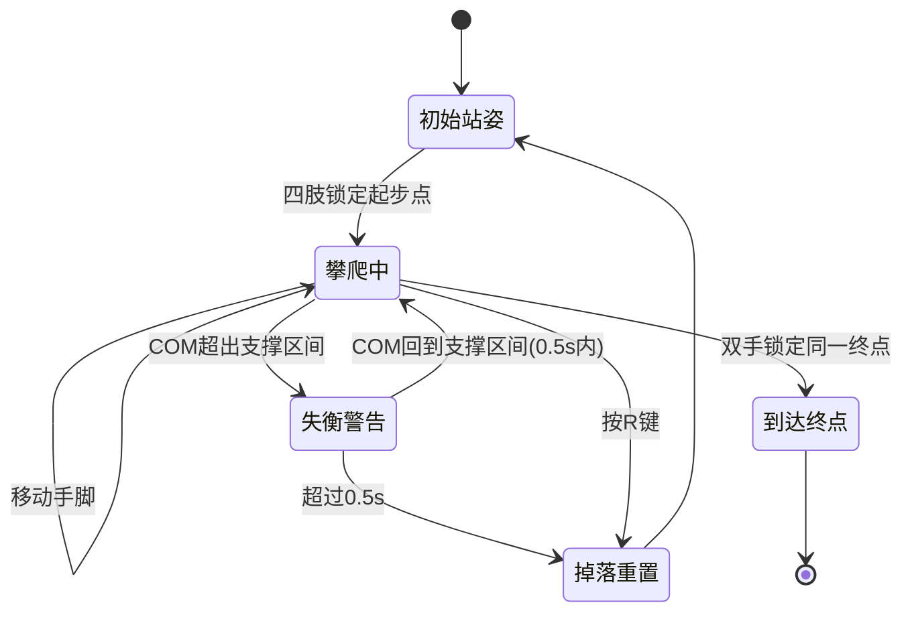

# 攀岩游戏 — 交互与UX设计文档

> 本文档面向 UI/UX 设计师和前端开发，描述游戏的交互方式、视觉反馈系统和界面布局。

---

## 一、界面布局

### 1.1 屏幕分区

```
+--------------------------------------------------+
|                                                  |
|                  游戏画面区域                      |
|         （角色 + 岩点 + 地面 + 反馈层）            |
|                                                  |
|                                                  |
+--------------------------------------------------+
|        [躯干] [左脚]        [摇杆区域]             |
| [左手]  [右手]  [右脚]                             |
+--------------------------------------------------+
```

- **上部（~80%）**：游戏画面，显示攀岩者、岩点、地面、所有视觉反馈
- **下部（~20%）**：操作区，左侧身体部位按钮 + 右侧摇杆

### 1.2 身体部位按钮

```
┌────────┐              ┌────────┐
│  左手   │              │  右手   │
│   Q     │              │   E     │
└────────┘              └────────┘
     ┌────────┐    ┌────────┐
     │  躯干   │    │  摇杆   │
     │   S     │    │  ○    │
     └────────┘    └────────┘
┌────────┐              ┌────────┐
│  左脚   │              │  右脚   │
│   A     │              │   D     │
└────────┘              └────────┘
```

按钮排列模仿人体结构：左手/右手在上排，躯干居中，左脚/右脚在下排。

---

## 二、交互方式

### 2.1 触摸交互

| 手势 | 位置 | 行为 |
|------|------|------|
| **点击** 部位按钮 | 按钮区 | 选中该身体部位 |
| **双击** 部位按钮 | 按钮区 | 释放该部位的岩点（手/脚脱离） |
| **双击** 躯干按钮 | 按钮区 | 切换身体跟随模式 |
| **拖拽** 摇杆 | 摇杆区 | 移动当前选中的身体部位 |
| **摇杆推到底** | 摇杆区 | 持续朝该方向移动（加速） |

### 2.2 键盘交互

| 按键 | 行为 |
|------|------|
| **Q** | 选中左手 / 双击释放左手 |
| **E** | 选中右手 / 双击释放右手 |
| **A** | 选中左脚 / 双击释放左脚 |
| **D** | 选中右脚 / 双击释放右脚 |
| **S** | 选中躯干 / 双击切换身体跟随模式 |
| **W** | 回正躯干侧倾（逐步减小侧倾角度） |
| **R** | 完全重置：角色回到初始姿势 |

### 2.3 双击判定

- 两次点击间隔 < **0.3 秒**视为双击
- 键盘同理：两次按下同一键间隔 < 0.3 秒视为双击
- 单击会延迟 0.3 秒生效（等待确认非双击），所以单击有轻微延迟感

### 2.4 摇杆与键盘的互斥规则

- **摇杆触摸中** + 按键盘 Q/E/A/D：直接释放对应部位（不切换选中）
- 这是为了方便双手操作：右手摇杆控制移动，左手键盘释放

---

## 三、视觉反馈系统

### 3.1 角色渲染

| 元素 | 颜色 | 说明 |
|------|------|------|
| 头部 | 肤色圆 | 头半径 ~16px × 缩放 |
| 躯干 | 衣服色矩形 | 宽 40、高 140 × 缩放 |
| 上臂/大腿 | 肤色线段 | 宽度 16px × 缩放 |
| 前臂/小腿 | 肤色线段 | 宽度 16px × 缩放 |
| 关节（肩/肘/髋/膝） | 肤色圆 | 半径 7px × 缩放 |
| 手末端 | 白色圆 | 半径 9px × 缩放 |
| 脚末端 | 白色圆 | 半径 9px × 缩放 |

### 3.2 选中高亮

当前选中的身体部位会被**金色光环**包围（`255, 215, 0`）：
- 选中的手/脚：金色圆圈围绕末端
- 选中的躯干：金色圆圈围绕质心（黄色点）

### 3.3 按钮状态

| 状态 | 视觉 |
|------|------|
| **未选中** | 白色文字，正常大小 |
| **选中** | 绿色文字（`100, 200, 100`），放大 1.1 倍 |
| **躯干-跟随模式开启** | 绿色文字 |
| **躯干-跟随模式关闭** | 白色文字（选中时仍为绿色） |

### 3.4 肢体锁定状态（颜色编码）

| 状态 | 颜色 | 含义 |
|------|------|------|
| 🟢 **受力良好** | 绿色 | 手臂拉力方向在岩点允许范围内 → 安全 |
| 🔴 **不受力** | 红色 | 手臂拉力方向超出岩点允许范围 → 即将松手！ |

颜色的应用范围：
- 手臂线段（上臂+前臂）
- 手末端圆点
- 腿部线段
- 脚末端圆点

### 3.5 岩点视觉

| 岩点类型 | 视觉标记 |
|----------|----------|
| **JUG / POCKET / CRIMP** | 金色扇形区域 = 受力方向范围（半透明黄色填充 + 描边） |
| **VOLUME** | 蓝色线段 + 两端蓝色圆点 + 中间绿色圆点标记 |

### 3.6 支撑与平衡反馈

| 元素 | 视觉 | 位置 |
|------|------|------|
| **地面线** | 灰色横线 | 场景底部 |
| **质心 (COM)** | 黄色实心圆 | 身体质心计算位置 |
| **支撑区间** | 绿色横线 | 支撑区间的 X 范围 |
| **双脚连线** | 红色粗线 | 左脚到右脚之间 |

### 3.7 失衡警告（关键！）

当质心超出支撑区间时：

| 阶段 | 视觉反馈 |
|------|----------|
| **开始失衡** | 质心处出现**红色闪烁圆** + **红色 X 标记** |
| **持续失衡** | 支撑区间底部出现**红色闪烁填充条** |
| **支撑线变红** | 支撑线变为红色粗线 |
| **掉落** | 角色重置到初始姿势 |

- 闪烁频率：周期性正弦波（约 1.6Hz）
- 目的：给玩家清晰的"你正在失去平衡"的紧迫感

### 3.8 吸附脚标记

已吸附到岩点的脚会额外显示**大红点**（半径 15px × 缩放），用于调试/区分吸附脚与自由脚。

---

## 四、操作流程 UX

### 4.1 典型操作序列

```
选中部位 → 拖动摇杆移动 → 靠近岩点自动吸附 → 换部位 → 继续攀爬
```

### 4.2 起步流程

```
初始站姿（地面）
  ↓ 选中手 → 拖动到起步岩点 → 自动吸附
  ↓ 换另一只手 → 同上
  ↓ 选中脚 → 拖动到起步岩点 → 自动吸附
  ↓ 换另一只脚 → 同上
  ↓ 🎉 四肢全部锁定起步点 → "起步成功"
```

### 4.3 攀爬流程

```
选中手 → 拖动脱离当前岩点 → 拖到新岩点 → 自动吸附
  ↓ （手臂超出范围时身体自动跟随）
选中脚 → 拖动脱离 → 拖到新岩点 → 自动吸附
  ↓ 重复...
  ↓ 注意观察质心是否在支撑区间内（绿灯=安全）
  ↓ 注意手臂颜色（绿色=安全，红色=即将松手）
```

### 4.4 终点到达

```
双手选中同一个终点岩点
  ↓ 双手均锁定在终点
  ↓ 双手受力角度均合法
  ↓ 🏁 "到达终点，游戏结束"
```

### 4.5 失败恢复

```
失衡警告（红色闪烁）
  ↓ 调整姿势恢复平衡 → 警告消失
  ↓ 或 持续 0.5 秒未恢复
  ↓ 💥 掉落！角色完全重置
  ↓ 按 R 也可随时手动重置
```

---

## 五、触摸操作细节

### 5.1 摇杆行为

```
触摸摇杆区域
  ├── 手指在摇杆范围内移动
  │   └── 相对位移 = 当前帧 thumb 位置 - 上一帧 thumb 位置
  │       └── 传递给玩家：moveActivePart(相对位移)
  │
  └── 手指推到摇杆边缘并保持
      └── 额外速度 = 方向 × 移动速度(200px/s) × dt
          └── 叠加到相对位移上
```

- 松开摇杆：thumb 回中，停止移动
- 触摸开始时：重置拖拽偏移（防止吸附后立即脱离）

### 5.2 摇杆与部位按钮的互斥

- 摇杆触摸期间，**点击部位按钮不会切换选中部位**
- 目的：防止操作摇杆时误触按钮

---

## 六、状态转换图



---

## 七、可访问性 / UX 建议

| 问题 | 当前状态 | 建议 |
|------|----------|------|
| 双击延迟 | 单击有 0.3s 延迟 | 考虑降低到 0.25s |
| 部位按钮标签 | 仅文字（左手/右手等） | 考虑加图标（手/脚 icon） |
| 失衡警告 | 红色闪烁 | 可加音效增强紧迫感 |
| 起步/终点提示 | console.log 仅开发可见 | 应该添加到游戏 UI（弹窗/横幅） |
| 岩点冷却 | 无视觉反馈 | 冷却中的岩点可变灰/加倒计时 |
| 身体跟随模式 | 仅躯干按钮颜色区分 | 可加独立图标或文字标签（"跟随: 开/关"） |
| 选中反馈 | 金色圆圈 | 可加虚线或呼吸动画 |
| 键盘提示 | 无 | 可在按钮上标注对应键盘按键（Q/E/A/D/S） |

---

## 八、色彩规范

| 用途 | 颜色 | RGBA |
|------|------|------|
| 选中高亮 | 金色 | `255, 215, 0, 255` |
| 按钮选中 | 绿色 | `100, 200, 100, 255` |
| 按钮默认 | 白色 | `255, 255, 255, 255` |
| 受力良好 | 绿色 | `0, 255, 0, 255` |
| 不受力/即将松手 | 红色 | `255, 0, 0, 255` |
| 质心 | 黄色 | `255, 255, 0, 255` |
| 支撑区间 | 绿色半透明 | `0, 255, 0, 80` |
| 失衡警告 | 红色 | `255, 0, 0, (动态alpha)` |
| 地面线 | 灰色 | `180, 180, 180, 255` |
| 力方向扇形 | 黄色半透明 | `255, 200, 0, 200` 填充 / `255, 200, 0, 50` 背景 |
| VOLUME 线段 | 蓝色 | `0, 120, 255, 200` |
| VOLUME 中点 | 青绿 | `0, 200, 120, 180` |
| 手支撑标记 | 蓝色 | `0, 100, 255, 200` |